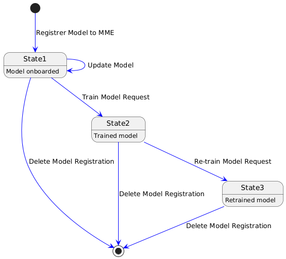

.. This work is licensed under a Creative Commons Attribution 4.0 International License.
.. http://creativecommons.org/licenses/by/4.0

.. Copyright (c) 2022 Samsung Electronics Co., Ltd. All Rights Reserved.

Installation Guide
==================

.. contents::
   :depth: 3
   :local:

Abstract
--------

This document describes how to install AIMLFW, demo scenarios, it's dependencies and required system resources.

Version history

+--------------------+--------------------+--------------------+-----------------------+
| **Date**           | **Ver.**           | **Author**         | **Comment**           |
|                    |                    |                    |                       |
+--------------------+--------------------+--------------------+-----------------------+
| 2022-11-30         | 0.1.0              | 		       | First draft           |
|                    |                    |                    |                       |
+--------------------+--------------------+--------------------+-----------------------+
| 2023-06-06         | 1.0.0              | Joseph Thaliath    | H Release             |
|                    |                    |                    |                       |
+--------------------+--------------------+--------------------+-----------------------+
| 2023-08-10         | 1.0.1              | Joseph Thaliath    | H Maintenance release |
|                    |                    |                    |                       |
+--------------------+--------------------+--------------------+-----------------------+
| 2023-12-14         | 1.1.0              | Joseph Thaliath    | I release             |
|                    |                    |                    |                       |
+--------------------+--------------------+--------------------+-----------------------+
| 2024-12-14         | 2.0.0              | Rajdeep Singh      | K release             |
|                    |                    |                    |                       |
+--------------------+--------------------+--------------------+-----------------------+

Introduction
------------

.. <INTRODUCTION TO THE SCOPE AND INTENTION OF THIS DOCUMENT AS WELL AS TO THE SYSTEM TO BE INSTALLED>

This document describes the supported software and hardware configurations for the reference component as well as providing guidelines on how to install and configure such reference system.

The audience of this document is assumed to have good knowledge in AI/ML tools, Kubernetes and Linux system.

Hardware Requirements
---------------------
.. <PROVIDE A LIST OF MINIMUM HARDWARE REQUIREMENTS NEEDED FOR THE INSTALL>

Below are the minimum requirements for installing the AIMLFW

#. OS: Ubuntu 24.04 server
#. 16 cpu cores
#. 32 GB RAM
#. 60 GB harddisk

..  _reference1:

Software Installation and Deployment
------------------------------------
.. <DESCRIBE THE FULL PROCEDURES FOR THE INSTALLATION OF THE O-RAN COMPONENT INSTALLATION AND DEPLOYMENT>

For stable m-release user can run following commands

.. code:: bash

        git clone -b m-release "https://gerrit.o-ran-sc.org/r/aiml-fw/aimlfw-dep"  # latest release branch is m-release
        cd aimlfw-dep

Any failure in m-release are tracked here 'https://lf-o-ran-sc.atlassian.net/browse/AIMLFW-286' 
Update recipe file :file:`RECIPE_EXAMPLE/example_recipe_latest_stable.yaml` which includes update of VM IP and datalake details.
Ensure image version is correct.

.. code:: bash

        # Install common libraries
        bin/install_libs.sh
        source ~/.bashrc

        # Install AIMLFW 
        bin/install_traininghost.sh RECIPE_EXAMPLE/example_recipe_latest_stable.yaml
         
**Note**: In case the Influx DB datalake is not available, this can be skipped at this stage and can be updated after installing datalake.
In case user prefers to check latest updates they can clone master branch (master branch can be unstable)

.. code:: bash

        git clone "https://gerrit.o-ran-sc.org/r/aiml-fw/aimlfw-dep"  # master branch
        cd aimlfw-dep

Update recipe file :file:`RECIPE_EXAMPLE/example_recipe_nexus_images_staging.yaml` which includes update of VM IP and datalake details.

.. code:: bash

        # Install common libraries
        bin/install_libs.sh
        source ~/.bashrc

        # Install AIMLFW 
        bin/install_traininghost.sh RECIPE_EXAMPLE/example_recipe_nexus_images_staging.yaml 

**Note**: For m-release use default RECIPE_FILE , that is RECIPE_EXAMPLE/example_recipe_latest_stable.yaml.In case you want to use master branch(not stable) for checking new updates use RECIPE_EXAMPLE/example_recipe_nexus_images_staging.yaml as RECIPE_FILE.
Check running state of all pods and services using below command :

.. code:: bash

        ~$ kubectl get pods --all-namespaces 
        
        kubeflow       cache-deployer-deployment-cf9646b9c-jxlqc          1/1     Running   0             53m
        kubeflow       cache-server-56d4959c9-sz948                       1/1     Running   0             53m
        kubeflow       leofs-bfc4794f5-7xfdn                              1/1     Running   0             56m
        kubeflow       metadata-envoy-deployment-9c7db86d8-7rlkf          1/1     Running   0             53m
        kubeflow       metadata-grpc-deployment-d94cc8676-mhw4l           1/1     Running   5 (47m ago)   53m
        kubeflow       metadata-writer-cd5dd8f7-6qsx6                     1/1     Running   1 (46m ago)   53m
        kubeflow       minio-5dc6ff5b96-4f9xd                             1/1     Running   0             53m
        kubeflow       ml-pipeline-85b6bf5f67-5x9lq                       1/1     Running   2             53m
        kubeflow       ml-pipeline-persistenceagent-fc7c944d4-bjz5n       1/1     Running   1 (46m ago)   53m
        kubeflow       ml-pipeline-scheduledworkflow-676478b778-h42kx     1/1     Running   0             53m
        kubeflow       ml-pipeline-ui-76bc4d6c99-8rw9x                    1/1     Running   0             53m
        kubeflow       ml-pipeline-viewer-crd-8574556b89-g5xw7            1/1     Running   0             53m
        kubeflow       ml-pipeline-visualizationserver-5d7c54f495-mhdtj   1/1     Running   0             53m
        kubeflow       mysql-5b446b5744-mcqlw                             1/1     Running   0             53m
        kubeflow       workflow-controller-679dcfdd4f-c64bj               1/1     Running   0             53m
        traininghost   aiml-dashboard-667c546669-rslbz                    1/1     Running   0             38m
        traininghost   aiml-notebook-5689459959-hd8r4                     1/1     Running   0             38m
        traininghost   cassandra-0                                        1/1     Running   0             41m
        traininghost   data-extraction-bd7dc6747-98ddq                    1/1     Running   0             39m
        traininghost   kfadapter-75c88574d5-ww7qb                         1/1     Running   0             38m
        traininghost   modelmgmtservice-56874bfc67-ct6lk                  1/1     Running   0             38m
        traininghost   tm-757bf57cb-rlx7v                                 1/1     Running   0             39m
        traininghost   tm-db-postgresql-0                                 1/1     Running   0             53m

**Note: In K Release, dashboard is not supported. We recomment to use cURL to interact with AIMLFW components. 
Details are provided in further section for each operation required for model training.**

Troubleshooting
---------------------------------

1. ImagePullBackOff Issue
^^^^^^^^^^^^^^^^^^^^^^^^^^^

If, after installation, some pods enter the ``ImagePullBackOff`` state (for example):

.. code:: bash

   kubeflow   ml-pipeline-ui-75d9df4ddb-5jvrb   0/1   ImagePullBackOff   0   22h

This typically indicates that the required container images could not be pulled automatically.
To resolve this issue, **manually pull and retag** the required images using the following commands:

.. code:: bash

        sudo nerdctl pull gcriomlpipeline/frontend:2.3.0 --namespace k8s.io
        sudo nerdctl tag gcriomlpipeline/frontend:2.3.0 gcr.io/ml-pipeline/frontend:2.3.0 --namespace k8s.io
        sudo nerdctl pull gcriomlpipeline/argoexec:v3.4.17-license-compliance --namespace k8s.io
        sudo nerdctl tag gcriomlpipeline/argoexec:v3.4.17-license-compliance  gcr.io/ml-pipeline/argoexec:v3.4.17-license-compliance --namespace k8s.io

Software Uninstallation & Upgrade
---------------------------------

Run the following script to uninstall the `traininghost`:

.. code:: bash

        bin/uninstall_traininghost.sh

To update the AIMLFW component, you need to follow a series of steps to ensure that the new changes are properly installed and integrated. 

.. code:: bash

        # Step 1: Uninstall the existing AIMLFW component
        bin/uninstall.sh

        # Step 2: Update the RECIPE_EXAMPLE/example_recipe_latest_stable.yaml file
        # Make necessary changes to the recipe file here

        # Step 3: Reinstall the AIMLFW component with the updated recipe
        bin/install.sh -f RECIPE_EXAMPLE/example_recipe_latest_stable.yaml

.. _install-influx-db-as-datalake:

..  _reference2:

DataLake Installation
----------------------

In the context of AIMLFW, a datalake can be used to store and manage large amounts of data generated by various sources. 

This section provides a detailed guide on how to install and configure a datalake for AIMLFW. Currently we support following methods to injest data for model-training: Standalone InfluxDB Installation and Prepare Non-RT RIC DME as a Data Source for AIMLFW.

1. Install Influx DB as datalake (Optional)
^^^^^^^^^^^^^^^^^^^^^^^^^^^^^^^^^^^^^^^^^^^

Standalone Influx DB can be installed using the following commands:

.. code:: bash

        helm install my-release --set image.repository=bitnamilegacy/influxdb bitnami/influxdb --version 5.13.5

        ~$ kubectl get pods

        NAME                                               READY   STATUS    RESTARTS        AGE
        my-release-influxdb-85888dfd97-77dwg               1/1     Running   0               15m

Use the following command to get `INFLUX_DB_TOKEN` which is required while creating feature-group.

.. code:: bash

        kubectl get secret my-release-influxdb -o jsonpath="{.data.admin-user-token}" | base64 --decode

**This section provides a detailed guide to onboard test-data to execute model-training.** 

Execute below from inside Influx DB container to create a bucket:

.. code:: bash

        # INFLUX_DB_TOKEN is referred to the influxDb-token collected in previous step:
        kubectl exec -it <influxdb-pod-name> -- influx bucket create -n UEData -o primary -t <INFLUX_DB_TOKEN>

Note: This Bucket name `UEData` will be reffered while creating featureGroup in further-steps.

Install the following dependencies which is required for parsing and onboarding data from `.csv` file:

.. code:: bash
        
        sudo apt install python3-pip
        sudo pip3 install pandas
        sudo pip3 install influxdb_client

Use the :file:`insert.py` in ``ric-app/qp repository`` to upload the qoe data in Influx DB

.. code:: bash

        git clone -b f-release https://gerrit.o-ran-sc.org/r/ric-app/qp
        cd qp/qp

Overwrite :file:`insert.py` file with the following content:

.. code-block:: python

        import pandas as pd
        from influxdb_client import InfluxDBClient
        from influxdb_client.client.write_api import SYNCHRONOUS
        import datetime

        class INSERTDATA:

           def __init__(self):
                self.client = InfluxDBClient(url = "http://localhost:8086", token="<INFLUX_DB_TOKEN>")

        def explode(df):
             for col in df.columns:
                     if isinstance(df.iloc[0][col], list):
                             df = df.explode(col)
                     d = df[col].apply(pd.Series)
                     df[d.columns] = d
                     df = df.drop(col, axis=1)
             return df
        

        def jsonToTable(df):
             df.index = range(len(df))
             cols = [col for col in df.columns if isinstance(df.iloc[0][col], (dict, list))]
             if len(cols) == 0:
                     return df
             for col in cols:
                     d = explode(pd.DataFrame(df[col], columns=[col]))
                     d = d.dropna(axis=1, how='all')
                     df = pd.concat([df, d], axis=1)
                     df = df.drop(col, axis=1).dropna()
             return jsonToTable(df)

        def time(df):
             df.index = pd.date_range(start=datetime.datetime.now(), freq='10ms', periods=len(df))
             df['measTimeStampRf'] = df['measTimeStampRf'].astype(str)
             return df

        def populatedb():
             df = pd.read_json('cell.json.gz', lines=True)
             df = df[['cellMeasReport']].dropna()
             df = jsonToTable(df)
             df = time(df)
             db = INSERTDATA()
             write_api = db.client.write_api(write_options=SYNCHRONOUS)
             write_api.write(bucket="UEData",record=df, data_frame_measurement_name="liveCell",org="primary")

        populatedb()

Update ``<INFLUX_DB_TOKEN>`` in :file:`insert.py` with the influxDb-token collected in previous step.

Follow below command to port forward for the script to access Influx DB (as no NodePort is exposed for InfluxDb)

.. code:: bash

        kubectl port-forward svc/my-release-influxdb 8086:8086

Execute the following script to onboard test-data to local influxDb:

.. code:: bash

        python3 insert.py

To check inserted data in Influx DB , execute below command inside the Influx DB container:

.. code:: bash

        # Token is referred to the acess-token collected in previous step:
        kubectl exec -it <influxdb-pod-name> -- influx query  'from(bucket: "UEData") |> range(start: -1000d)' -o primary -t <INFLUX_DB_TOKEN>

        Result: _result
        Table: keys: [_start, _stop, _field, _measurement]
                        _start:time                      _stop:time           _field:string     _measurement:string                      _time:time                  _value:int
        ------------------------------  ------------------------------  ----------------------  ----------------------  ------------------------------  --------------------------
        2022-05-18T12:52:18.008858111Z  2025-02-11T12:52:18.008858111Z              availPrbDl                liveCell  2025-01-23T17:01:22.563381000Z                          45
        2022-05-18T12:52:18.008858111Z  2025-02-11T12:52:18.008858111Z              availPrbDl                liveCell  2025-01-23T17:01:22.573381000Z                          91
        2022-05-18T12:52:18.008858111Z  2025-02-11T12:52:18.008858111Z              availPrbDl                liveCell  2025-01-23T17:01:22.583381000Z                         273
        2022-05-18T12:52:18.008858111Z  2025-02-11T12:52:18.008858111Z              availPrbDl                liveCell  2025-01-23T17:01:22.593381000Z                          53

..  _reference3:

Prepare Non-RT RIC DME as data source for AIMLFW (optional)
-----------------------------------------------------------

Please refer to the `RANPM Installation Guide <https://docs.o-ran-sc.org/projects/o-ran-sc-aiml-fw-aimlfw-dep/en/latest/ranpm-installation.html>`__  to install NonRtRic's RANPM and Prepare the DME as a data-soruce for AIMLFW.

        
Feature Group Creation
----------------------

A Feature Group is a logical entity to represent structured dataset, often stored in a Feature Store, to ensure consistency and reusability across different ML models and pipelines.

Following is the cURL request to create a feature group.

.. code:: bash

        curl --location 'http://<VM IP where AIMLFW is installed>:32002/ai-ml-model-training/v1/featureGroup' \
              --header 'Content-Type: application/json' \
              --data '{
                        "featuregroup_name": "<Name of the feature group>",
                        "feature_list": "<Features in a comma separated format>",
                        "datalake_source": "<DATALAKE_SOURCE>",
                        "enable_dme": <True for DME use, False for Standalone Influx DB>,
                        "host": "<IP of VM where Influx DB is installed>",
                        "port": "<Port of Influx DB>",",
                        "dme_port": "<If DME is True, then it refers to the Nodeport of InformationService (in RANPM)>",
                        "bucket": "<Bucket Name>",
                        "token": "<INFLUX_DB_TOKEN>",
                        "source_name": "<If DME is True, any source name. but same needs to be given when running push_qoe_data.sh>",
                        "measured_obj_class": "<Applicable in case of DME>",
                        "measurement": "<Measurement of the db that contains your features>",
                        "db_org": "<Org of the db>"
                    }'

Below are two examples covering supported scenarios for Data Injestion.

**1.  Non-RT RIC DME based feature group creation for Qoe Usecase**

.. code:: bash

            curl --location '<AIMLFW-Ip>:32002/ai-ml-model-training/v1/featureGroup' \
            --header 'Content-Type: application/json' \
            --data '{
                    "featuregroup_name": "<FEATURE_GROUP_NAME>",
                    "feature_list": "x,y,pdcpBytesDl,pdcpBytesUl",
                    "datalake_source": "InfluxSource",
                    "enable_dme": true,
                    "host": "<RANPM-IP>",
                    "port": "8086",
                    "dme_port": "31823",
                    "bucket": "pm-logg-bucket",
                    "token": "<INFLUX_DB_TOKEN>",
                    "source_name": "",
                    "measured_obj_class": "NRCellDU",
                    "measurement": "test,ManagedElement=nodedntest,GNBDUFunction=1004,NRCellDU=c4_B13",
                    "db_org": "est"
            } '

**2. Standalone Influx DB based feature group creation for Qoe Usecase.**

.. code:: bash

        curl --location 'http://<VM IP where AIMLFW is installed>:32002/ai-ml-model-training/v1/featureGroup' \
              --header 'Content-Type: application/json' \
              --data '{
                        "featuregroup_name": "<Feature Group name>",
                        "feature_list": "pdcpBytesDl,pdcpBytesUl",
                        "datalake_source": "InfluxSource",
                        "enable_dme": false,
                        "host": "my-release-influxdb.default",
                        "port": "8086",
                        "dme_port": "",
                        "bucket": "UEData",
                        "token": "<INFLUX_DB_TOKEN>",
                        "source_name": "",
                        "measured_obj_class": "",
                        "measurement": "liveCell",
                        "db_org": "primary"
                    }'

Register Model 
---------------

A model MUST be registered to the Model-Management-Service (MME) before submitting any training request. 
A model is uniquely identified by modelName and modelVersion.
Following is the sample cURL request to be used for registering the model.

.. code:: bash

        curl --location 'http://<VM IP where AIMLFW is installed>:32006/ai-ml-model-registration/v1/model-registrations' \
              --header 'Content-Type: application/json' \
              --data '{
                    "modelId": {
                        "modelName": "modeltest1",
                        "modelVersion": "1"
                    },
                    "description": "This is a test model.",
                    "modelInformation": {
                        "metadata": {
                            "author": "John Doe"
                        },
                        "inputDataType": "pdcpBytesDl,pdcpBytesUl",
                        "outputDataType": "pdcpBytesDl,pdcpBytesUl"
                    }
                }'

        # inputDataType & outputDataType represents the input(features) & output for trainedModels.
        # Note: Currently, outputDataType is not fucntionality used in implementation.

Model Discovery
---------------

This section describes model-discovery and its various options.

a. To fetch all registered models, use the following API endpoint:

.. code:: bash

    curl --location 'http://<VM IP where AIMLFW is installed>:32006/ai-ml-model-discovery/v1/models'

b. To fetch models with modelName, use the following API endpoint:

.. code:: bash

    curl --location 'http://<VM IP where AIMLFW is installed>:32006/ai-ml-model-discovery/v1/models?model-name=<model_name>'

c. To fetch specific model, use the following API endpoint:

.. code:: bash

    curl --location 'http://<VM IP where AIMLFW is installed>:32006/ai-ml-model-discovery/v1/models?model-name=<model_name>&&model-version=<model_version>'

Onboarding Training/Re-Training Pipelines
-------------------------------------------

Training and retraining pipelines in AIMLFW (AI/ML Framework for O-RAN SC) are structured sequences of steps designed to train or retrain ML models. These pipelines automate the execution of data processing, model training, evaluation, and storage, ensuring a streamlined workflow.

1. Onboard Pre-Existing Pipeline
^^^^^^^^^^^^^^^^^^^^^^^^^^^^^^^^^

AIMLFW does not come preloaded with the `qoe-pipeline` (responsible for model training) and `qoe-pipeline-retrain-2` (responsible for model retraining). These pipelines need to be manually onboarded before they can be used in AIMLFW workflows.

**Steps to Onboard Pre-existing Pipelines:**

1. Access the Jupyter Dashboard
Open a web browser and navigate to: `http://<VM-Ip of AIMLFW>:32088/tree?`

2. Load the Required Notebook
Locate the notebook corresponding to each pipeline:
qoe-pipeline for training
qoe-pipeline-retrain-2 for retraining

3. Execute the Notebook Cells
Open the respective notebook.
Run all the cells in the notebook sequentially.

This process registers the pipeline in Kubeflow so it can be used by AIMLFW.
Once these steps are completed, the pipelines will be available for use within AIMLFW training operations.

2. Onboard Custom Pipeline (Optional)
^^^^^^^^^^^^^^^^^^^^^^^^^^^^^^^^^^^^^^

| To use a training/retraining pipeline in AIMLFW, it needs to be onboarded into the system. This involves the following steps:
| **a. Pipeline Definition**: A pipeline must be defined in code (e.g., Python) using Kubeflow Pipelines SDK. It includes all necessary ML steps, such as data ingestion, preprocessing, training, and model deployment.
| **b. Pipeline Registration**: The pipeline must be registered in Kubeflow Pipelines so that AIMLFW can utilize it. This is done by compiling the pipeline code and uploading it to the pipeline repository.
| **c. Pipeline Invocation**: During training instance creation, users must specify the required pipeline.AIMLFW uses the registered pipeline to launch a training/retraining job.

Following is a sample `pseudo-code` for a custom pipeline which user can implement and onboard.

.. code:: python

        from kfp import dsl
        from kfp.compiler import Compiler
        from kubernetes import client as k8s_client

        @dsl.pipeline(
        name="Model Training Pipeline",
        description="A sample pipeline for training a machine learning model"
        )
        def training_pipeline():
                # Implement the trainingPipeline Here
                

        # Compile the pipeline to yaml-file
        Compiler().compile(training_pipeline, "<OutputFile.yaml>")

        # Upload Pipeline to AIMLFW
        import requests
        requests.post("http://<VM-Ip where AIMLFW is installed>:32002/pipelines/<Training_Pipeline_Name>/upload", files={'file':open("<OutputFile.yaml>",'rb')})

One can refer `kubeflow documentation <https://www.kubeflow.org/docs/components/pipelines/>`__ for implementing your pipeline.

Training job creation with DME or Standalone InfluxDB as data source
--------------------------------------------------------------------

Creating a training job in AIMLFW involves defining the training pipeline, specifying the necessary configurations, and submitting the job for execution. The user needs to provide essential parameters. Once submitted, the pipeline runs within Kubeflow, leveraging AIMLFW’s orchestration capabilities to manage the training workflow. The status and progress of the training job can be monitored through logs.

You can create a TrainingJob using the following cURL command:

.. code:: bash

        curl --location 'http://<VM IP where AIMLFW is installed>:32002/ai-ml-model-training/v1/training-jobs' \
              --header 'Content-Type: application/json' \
              --data '{
                        "modelId":{
                            "modelName": "modeltest1",
                            "modelVersion": "1"
                        },
                        "modelLocation": "",
                        "trainingConfig": {
                            "description": "trainingjob for testing",
                            "dataPipeline": {
                                "feature_group_name": <Name of FeatureGroup created >,
                                "query_filter": "<This query-filter will be used to filter/transform your features>",
                                "arguments": {"epochs": 1}
                            },
                            "trainingPipeline": {
                                    "training_pipeline_name": "qoe_Pipeline", 
                                    "training_pipeline_version": "qoe_Pipeline", 
                                    "retraining_pipeline_name":"qoe_Pipeline_retrain",
                                    "retraining_pipeline_version":"qoe_Pipeline_retrain"
                            }
                        },
                        "trainingDataset": "",
                        "validationDataset": "",
                        "notificationDestination": "",
                        "consumerRAppId": "",
                        "producerRAppId": ""
                    }'

| Note:
| 1. The modelName and modelVersion must be registered on MME before initiating the training request.
| 2. For the initial training request, the trainingPipeline and trainingPipelineVersion will be used to train the model.
| 3. Any subsequent training requests will be considered retraining, in which case retraining_pipeline_name and retraining_pipeline_version will be used to train the model.
| 4. The training_pipeline_name/retraining_pipeline_name is a name which is used while onboarding the pipeline in the jupyter notbook.

Following is the example used for Standalone-InfluxDb as a Data-Source:

.. code:: bash

        curl --location 'http://<VM IP where AIMLFW is installed>:32002/ai-ml-model-training/v1/training-jobs' \
              --header 'Content-Type: application/json' \
              --data '{
                        "modelId":{
                            "modelName": "modeltest1",
                            "modelVersion": "1"
                        },
                        "modelLocation": "",
                        "trainingConfig": {
                            "description": "trainingjob for testing",
                            "dataPipeline": {
                                "feature_group_name": <Name of FeatureGroup created >,
                                "query_filter": "",
                                "arguments": {"epochs": 1}
                            },
                            "trainingPipeline": {
                                    "training_pipeline_name": "qoe_Pipeline", 
                                    "training_pipeline_version": "qoe_Pipeline", 
                                    "retraining_pipeline_name":"qoe_Pipeline_retrain",
                                    "retraining_pipeline_version":"qoe_Pipeline_retrain"
                            }
                        },
                        "trainingDataset": "",
                        "validationDataset": "",
                        "notificationDestination": "",
                        "consumerRAppId": "",
                        "producerRAppId": ""
                    }'

..  _reference7:

Obtain the Status of Training Job
---------------------------------

The Status of Trainingjob can be fetched using the following API endpoint. Replace <TrainingjobId> with the ID of the training job which is collected from response of the previous request.

.. code:: bash

    curl --location http://<AIMLFW-Ip>:32002/ai-ml-model-training/v1/training-jobs/<TrainingjobId>/status

..  _reference5:

Obtain Model URL for deploying trained models
---------------------------------------------

You can curl the following API endpoint to obtain Trainingjob Info and fetch model_url for deployment after training is complete. Replace <TrainingjobId> with the ID of the training job.

.. code:: bash

    curl --location 'http://<AIMLFW-Ip>:32002/ai-ml-model-training/v1/training-jobs/<TrainingjobId>'

OR you can download the model using Model_name, Model_version, Model_artifact_version as follows:

.. code:: bash

    wget http://<AIMLFW-Ip>:32002/model/<MODEL_NAME>/<MODEL_VERSION>/<MODEL_ARTIFACT_VERSION>/Model.zip

Model-Retraining
----------------------------------------

Retraining is the process of updating an existing model by incorporating new data or refining its parameters to improve performance. In AIMLFW, retraining jobs follow a structured pipeline similar to training but leverage previously trained models as a starting point. Users need to specify the retraining pipeline

A previously trained model can be retrained with different configurations/data as follows:

.. code:: bash

        curl --location '<AIMLFW-Ip>:32002/ai-ml-model-training/v1/training-jobs' \
        --header 'Content-Type: application/json' \
        --data '{
                "modelId": {
                "modelName":"<MODEL_TO_RETRAIN>",
                "modelVersion":"<MODEL_VERSION_TO_RETRAIN>"
        },
        "trainingConfig": {
                "description": "Retraining-Example",
                "dataPipeline": {
                "feature_group_name": "<FEATUREGROUP_NAME>",
                "query_filter": "",
                "arguments": {"epochs": 20}
                },
                "trainingPipeline": {
                        "training_pipeline_name": "qoe_Pipeline",
                        "training_pipeline_version": "qoe_Pipeline",
                        "retraining_pipeline_name": "qoe_Pipeline_retrain",
                        "retraining_pipeline_version": "qoe_Pipeline_retrain"
                }
        },
        "modelLocation": ""
        }'

| The user can specify different configurations as well as retraining-pipeline by modifying the training-config.
| The default `qoe_Pipeline_retrain` pipeline fetches and loads the existing model, retrains it with new arguments or data, and updates the artifact version from 1.0.0 to 1.1.0.

Verify Updated Artifact-Version after retraining from MME

.. code:: bash

        curl --location '<AIMLFW-Ip>:32006/ai-ml-model-discovery/v1/models/?model-name=<MODEL_NAME>&model-version=<MODEL_VERSION>'

| Note: 
| a. The QoE retraining function does not come pre uploaded, we need to go to training function, create training function and run the `qoe-pipeline-retrain-2` notebook.
| b. Subsequent retrainings will update the artifact version as follows: 
|               From 1.x.0 to 1.(x + 1).0

Below state diagram captures the flow for model state for training/training.

.. code-block::
        
        @startuml
                [*] -[#blue]-> State1 : Registrer Model to MME
                State1 -[#blue]-> State1 : Update Model
                State1 -[#blue]-> [*] : Delete Model Registration
                State1 : Model onboarded
                State1 -[#blue]-> State2 : Train Model Request
                State2 : Trained model
                State2 -[#blue]-> [*] : Delete Model Registration
                State2 -[#blue]-> State3 : Re-train Model Request
                State3 : Retrained model
                State3 -[#blue]-> [*] : Delete Model Registration
        @enduml

..  _reference4:

Model-Deployment
----------------------------------------

1. Using Kserve
^^^^^^^^^^^^^^^^^

1. Installing Kserve

.. code:: bash

        ./bin/install_kserve.sh

2. Verify Installation

.. code:: bash

        ~$ kubectl get pods -n kserve
        
        NAME                                        READY   STATUS    RESTARTS   AGE
        kserve-controller-manager-5d995bd58-9pf6x   2/2     Running   0          6d18h

3. Deploy trained qoe prediction model on Kserve

.. code:: bash

        # Create namespace
        kubectl create namespace kserve-test

Create :file:`qoe.yaml` file with below contents

.. code-block:: yaml

        apiVersion: "serving.kserve.io/v1beta1"
        kind: "InferenceService"
        metadata:
          name: "qoe-model"
          namespace: kserve-test
        spec:
          predictor:
            model:
              modelFormat:
                name: tensorflow
              storageUri: "<MODEL URL>"

To deploy model update the Model URL in the :file:`qoe.yaml` file and execute below command to deploy model
Refer :ref:`Obtain Model URL for deploying trained models <reference5>`

.. code:: bash

        kubectl apply -f qoe.yaml

        
Verify Model-Deployment

.. code:: bash

        ~$ kubectl get InferenceService -n kserve-test

        NAME        URL                                              READY   PREV   LATEST   PREVROLLEDOUTREVISION   LATESTREADYREVISION         AGE
        qoe-model   http://qoe-model.kserve-test.svc.cluster.local   True           100                              qoe-model-predictor-00001   42s

        ~$ kubectl get pods -n kserve-test

        NAME                                                   READY   STATUS    RESTARTS   AGE
        qoe-model-predictor-00001-deployment-86d9db6cb-5r8st   2/2     Running   0          93s         

4. Test predictions using model deployed on Kserve

In order to test our deployed-model, we will query the InferenceService from a curl-pod.

.. code:: bash

        # Deploy a curl-pod
        kubectl run curl-pod --image=curlimages/curl:latest --command sleep 3600
        # Query Inference-Service
        kubectl exec -it curl-pod -- \
                curl   \
                --location http://qoe-model.kserve-test.svc.cluster.local/v1/models/qoe-model:predict \
                --header "Content-Type: application/json" \
                --data '{
                        "signature_name": "serving_default",
                        "instances": [[
                                [2.56, 2.56],
                                [2.56, 2.56],
                                [2.56, 2.56],
                                [2.56, 2.56],
                                [2.56, 2.56],
                                [2.56, 2.56],
                                [2.56, 2.56],
                                [2.56, 2.56],
                                [2.56, 2.56],
                                [2.56, 2.56]]
                                ]
                        }'

| Note: We can change which deployed-model to query by changing the location as:
| location = <KSERVE_HOST>/v1/models/<MODEL_NAME>:predict, where
| a. MODEL_NAME: Refers to the Name of Inference-Service
| b. KSERVE_HOST: Refers to the URL of Inference-Service

5. Uninstall Kserve

.. code:: bash

        ./bin/uninstall_kserve.sh 

For Advanced usecases, Please refer to official kserve-documentation `here <https://kserve.github.io/archive/0.11/get_started/first_isvc/#1-create-a-namespace>`__ 

2. Install both Kserve and Kserve adapter for deploying models (Optional/Not validated in k-release)
^^^^^^^^^^^^^^^^^^^^^^^^^^^^^^^^^^^^^^^^^^^^^^^^^^^^^^^^^^^^^^^^^^^^^^^^^^^^^^^^^^^^^^^^^^^^^^^^^^^^^

To install Kserve run the below commands
Please note to update the DMS IP in example_recipe_latest_stable.yaml before installation 

.. code:: bash

        ./bin/install_kserve_inference.sh

**Uninstall both Kserve and Kserve adapter for deploying models**

To uninstall Kserve run the below commands

.. code:: bash

        ./bin/uninstall_kserve_inference.sh

..  _reference6:

**Steps to deploy model using Kserve adapter**

Prerequisites

#. Install chart museum
#. Build ricdms binary

#. Run ric dms

   .. code:: bash

        export RIC_DMS_CONFIG_FILE=$(pwd)/config/config-test.yaml
        ./ricdms

#. Create sample_config.json

   Create sample_config.json file with the following contents

   .. code:: bash

        {
          "xapp_name": "sample-xapp",
          "xapp_type": "inferenceservice",
          "version": "2.2.0",
          "sa_name": "default",
          "inferenceservice": {
              "engine": "tensorflow",
              "storage_uri": "<Model URL>",
              "runtime_version": "2.5.1",
              "api_version": "serving.kubeflow.org/v1beta1",
              "min_replicas": 1,
              "max_replicas": 1
          }
        }

       Refer :ref:`Obtain Model URL for deploying trained models <reference5>`

#. Copy sample_config.json
  
   Update the below command with kserve adapter pod name 

   .. code:: bash

      kubectl cp sample_config.json ricips/<kserve adapter pod name>:pkg/helm/data/sample_config.json

#. Generating and upload helm package

   .. code:: bash

        curl --request POST --url 'http://127.0.0.1:31000/v1/ips/preparation?configfile=pkg/helm/data/sample_config.json&schemafile=pkg/helm/data/sample_schema.json'

#. Check uploaded charts

   .. code:: bash

        curl http://127.0.0.1:8080/api/charts

#. Deploying the model

   .. code:: bash

        curl --request POST --url 'http://127.0.0.1:31000/v1/ips?name=inference-service&version=1.0.0'

#. Check deployed Inference service

   .. code:: bash

        kubectl get InferenceService -n ricips

